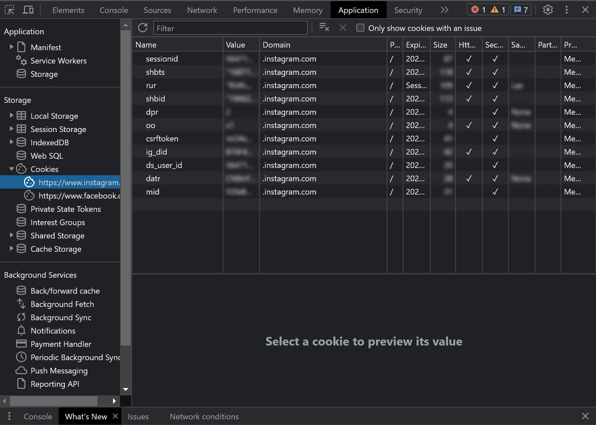
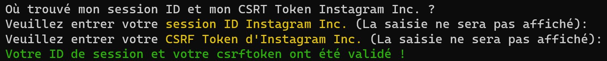
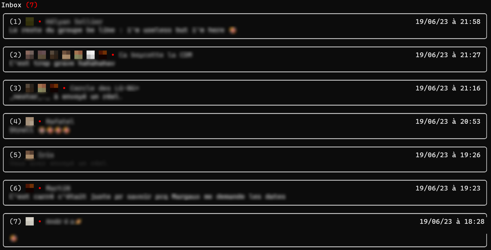
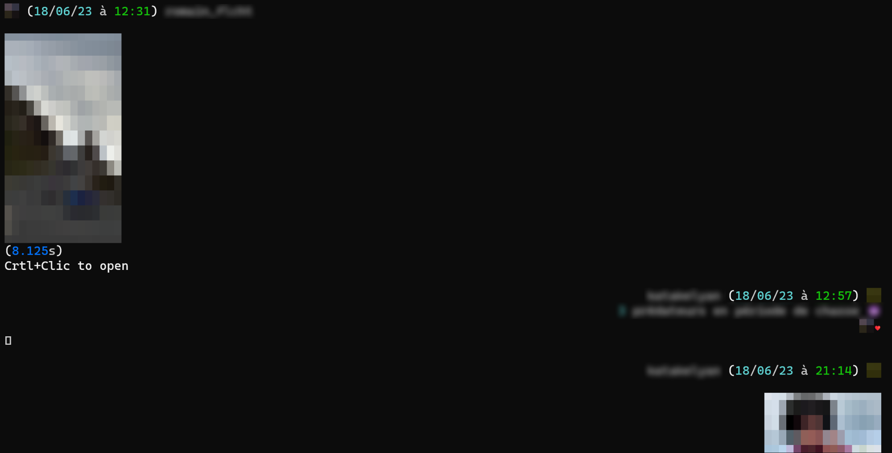

# igdm_terminal
This project allows you to see your instagram direct messages on your terminal :)

## Abandonned...
<b>After several attempts, I have decided to abandon this project due to Instagram's highly advanced automatic behavior detection... Unfortunately, I don't have the time or determination to reverse-engineer their requests and bypass these restrictions.</b>

<b>If you feel up to the challenge, don't hesitate to take over! This project is close to my heart, and I'd love to see it completed.🙂</b>

## Installation
To install all the necessary libraries, you will need to use:
```bash
pip install -r requirements.txt
```


## Execution
To start the program execute the `main.py` file. 
- Windows
```bash
python main.py
```
- MacOS & Linux
```bash
python3 main.py
```

## Login
To link your Instagram account to this program, you will need to obtain your `sessionid` and `csrftoken`. 
Open your web browser, log into your Instagram account, and search for the cookies used by Instagram. 
Inside, you will find your `sessionid` and `csrftoken`.

- Example (Using Chrome):
<p align="center">
  
  <br />
  <i>Development tools > Application > Cookies > Instagram</i>
</p>


Once you have those, you can run the `main.py` file and enter your login information when prompted.
<p align="center">
  
  <br />
  <i>Login successful !</i>
</p>

your login information can be saved as either: 
 - *Clear text* (not recommended)
 - *blowfish* encrypted file, requires that you type a password at startup (recommended for use on linux with no DE)
 - *keyring* uses your system's keyring to store info (requires a keyring, recommended for windows, mac and linux with a DE)

## Tweaks
You can choose how many threads and items are displayed during runtime. To change those values, modify the two lines in the `main.py` file. 

```python
CONV_INBOX_NB = 20 # Will display 20 conversations in the inbox menu. 
CONV_ITEMS_NB = 30 # Will display 30 items in the selectec conversation. 
```

## Enjoy :)
Here is some screenshots of the program running : 

<p align="center">
  
  <br />
  <i>Inbox</i>
</p>

<p align="center">
  
  <br />
  <i>Conversations</i>
</p>

<s>(proudly)</s> Supported features : 
- 📄 Text
- 🌐 Link
- 🎬 Clip
- 🖼️ Media share (images & video)
- 🔊 Voice media
- 📷 See Once media
- 📖 Story share & reactions
- 📹 Reel share
- ⚠️ Placeholder
- ❤️ Liked messages
- <s>📤 Sent direct message</s>

## Licence
- romainflcht
